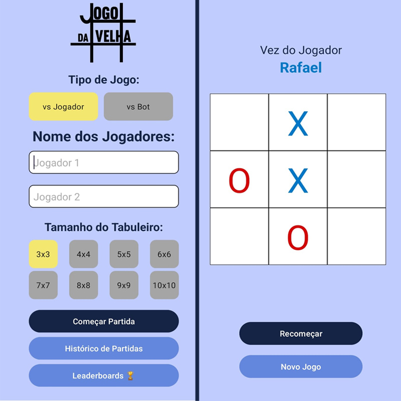
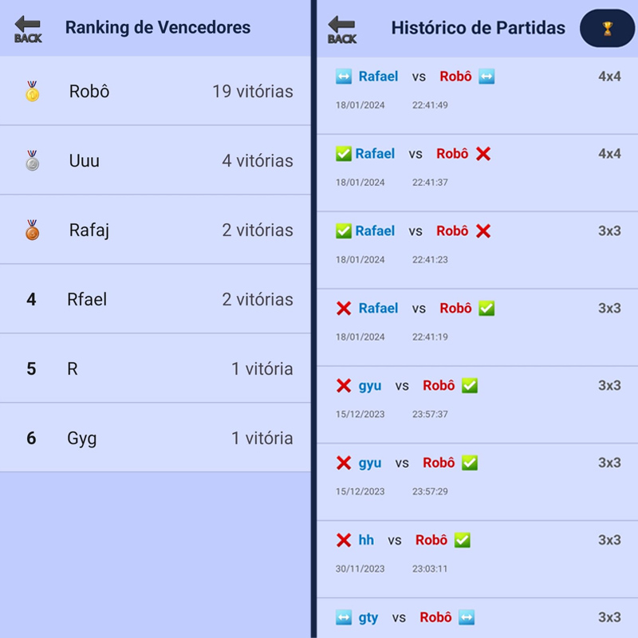

# Jogo da Velha

### Aplicativo para Android

Jogo da Velha com tamanhos variados de tabuleiro, histórico de partidas,
ranking de vitórias e bot inteligente.

Autor: Rafael Assunção Ladeira Torga

Contato: rafaaslat@gmail.com | github.com/rafaalt

## Requisitos do Sistema

- [Android Studio](https://developer.android.com/studio)
- [SDK Mínima: API 28 - Android 9.0](https://developer.android.com/studio/releases/platforms)

## Como Baixar

1. Baixe o código-fonte do aplicativo como um arquivo ZIP.
2. Descompacte o arquivo ZIP em um diretório de sua escolha.

## Configuração do Android Studio

1. Abra o Android Studio.
2. Selecione "File" (Arquivo) > "Open" (Abrir).
3. Navegue até o diretório onde o código-fonte foi descompactado.
4. Selecione o diretório do projeto e clique em "OK".

## Configuração de Dispositivo

Você pode executar o aplicativo em um dispositivo virtual ou físico.

Certifique-se de escolher um dispostivo com API 28 ou superior.

Siga os passos apropriados para configurar um dispositivo:

- [Configurar um Dispositivo Virtual](https://developer.android.com/studio/run/managing-avds?hl=pt-br)
- [Conectar um Dispositivo Físico](https://developer.android.com/studio/run/device?hl=pt-br)

## Sobre o projeto

Aplicativo para Android feito utilizando a linguagem Java.

### Funcionalidades

1. Jogo da Velha com variados tamanhos de tabuleiro variando de 3x3 até 10x10.
2. Possibilidade de jogar em 2 jogadores ou com a máquina(Bot).
3. Verificação dos nomes não permitindo espaços no nome do jogador.
4. Após o término de uma partida ela é salva no banco de dados, permitindo ser visualizada
   entre distintas execuções do aplicativo.
5. Botão Histórico permitindo visualizar todas as partidas incluindo seu vencedor e tamanho do tabuleiro.
6. Botão Ranking permitindo visualizar os jogadores com mais vitórias nas partidas presentes
   no banco de dados, ignorando letras maíusculas e minúsculas.
7. Bot Inteligente

   7.1 Sempre que o bot estiver a um movimento de ganhar ele irá escolher o lugar correto.

   7.2 Sempre que o bot estiver a um movimento de perder ele irá evitar a derrota sempre que possível.

   7.3 Sempre que possível o Bot irá realizar um movimento próximo da sua última jogada a fim de melhoras
   suas chances de vitória.
8. Night Mode Disponível

   Ao acessar o aplicativo utilizando o night mode do dispostivo as cores e logo são alteradas para o modo noturno.
9. Alertas e Avisos indicando o término das partidas.

### Screenshots

